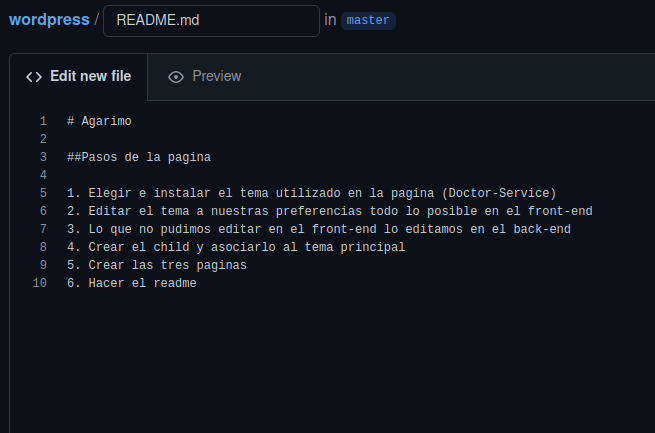
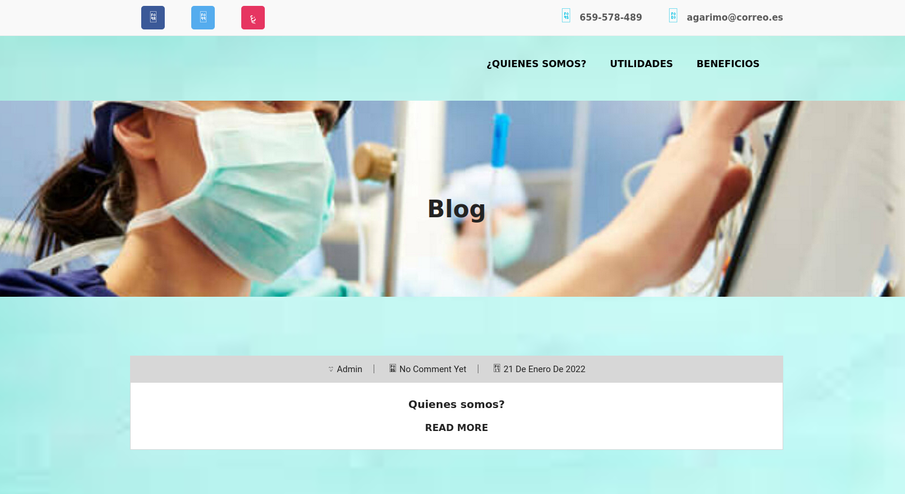
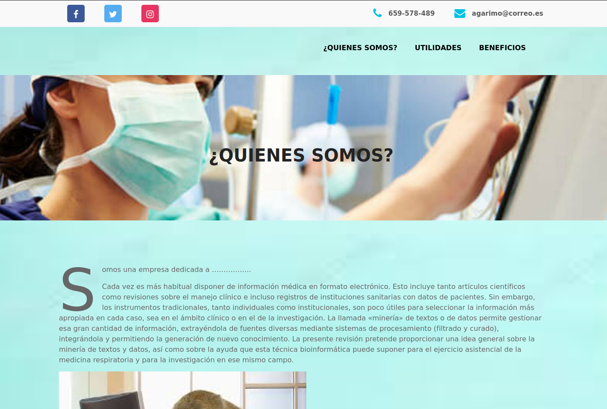

# Agarimo

## Pasos de la pagina

1. Elegir e instalar el tema utilizado en la pagina ([Doctor-Service](https://github.com/plagocastro/wordpress/tree/master/html/wp-content/themes/doctor-service))
2. Editar el tema a nuestras preferencias todo lo posible en el front-end
3. Lo que no pudimos editar en el front-end lo editamos en el back-end
4. Crear el [child](https://github.com/plagocastro/wordpress/tree/master/html/wp-content/themes/doctor-service-Child) y asociarlo al tema principal
5. Crear las tres paginas 
6. Hacer el readme

 

## Imagenes de la pagina

 

 
